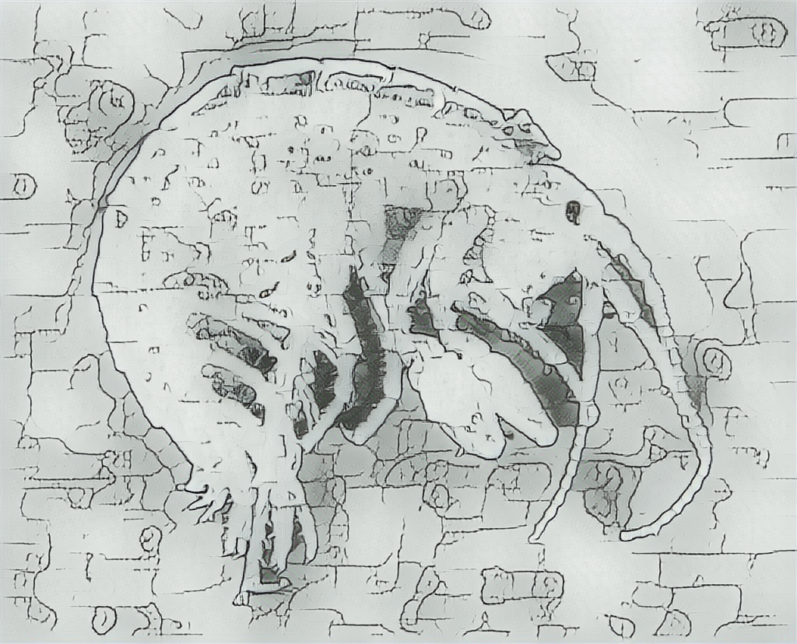

# amphip
> ... <br>
> a esta altura <br>
> no ha de ser un secreto <br>
> para nadie <br>
>
> yo estoy contra los puentes levadizos. <br>
>
> -- Mario Benedetti, "Contra los puentes levadizos" (1965-1966).


## Overview



`amphip` is a domain specific language (DSL) that extends the algebraic modeling language GNU MathProg to support scenario-based multistage stochastic programming. The DSL is embedded in the Scala programming language, allowing models to be transformed and manipulated. It uses functional programming aiming to get the desired functionality with code that is more modular, reusable, concise, and with fewer defects.

## Quick Start

To use this library, please [download the corresponding `jar`](https://github.com/gerferra/amphip/releases/latest) and add it to your project's classpath. In an sbt project, you can do that by copying the file under the `lib` directory. 

For example, if you have an `amphip-test` sbt project, then you need a structure like this:
```bash 
amphip-test
└── build.sbt
└── lib
    └── amphip-core-assembly_2.12-1.0.0.jar
```

In `build.sbt` you can specify the Scala version. Current version of `amphip` needs Scala 2.12.

```scala
scalaVersion := "2.12.17"
```

As a quick example, here is the p-median problem implementation in `amphip`. In this case it is written directly in a Scala REPL opened in the context of the sbt project `amphip-test`.

```bash
~/devel/amphip-test$ sbt

sbt:amphip-test> console
```

The DSL can be accessed importing `amphip.dsl._`

```scala
scala> import amphip.dsl._
```

The full model can be copied to the REPL using the "paste mode"

```scala
scala> :paste

// Example p-median model in amphip.
// Copy the following lines and paste them in the Scala REPL. When finished, press Ctrl-D to exit the paste mode.

val N = param >= 1
val n = dummy
val Locations = set := 1 to N

val P = param >= 1 <= N

val M = param >= 1
val m = dummy
val Customers = set := 1 to M

val d = param(Locations, Customers)

val x = xvar(Locations, Customers) >= 0 <= 1
val y = xvar(Locations).binary

val obj = 
  minimize {
    sum(n in Locations, m in Customers) { d(n,m) * x(n,m) }
  }

val singleX = st(m in Customers) { sum(n in Locations)(x(n,m)) === 1 }
val boundY = st(n in Locations, m in Customers) { x(n,m) <= y(n) }
val numFacilities = st { sum(n in Locations)(y(n)) === P }

val mipModel = model(obj, singleX, boundY, numFacilities)

// Data section

val NData = 1000
val MData =  100
val PData =  100

def uniform(min: Double, max: Double): Double = {
  scala.util.Random.nextDouble() * (max - min) + min
}

val mipModelWData = 
  mipModel
    .paramData(N, NData)
    .paramData(M, MData)
    .paramData(P, PData)     
    .paramData(d, (1 to NData * MData).map(_ => uniform(1, 2)))

// ...Press Ctrl-D to exit the paste mode...
```

The problem can be solved by [shelling out to glpsol](#solver-integration)

```scala
scala> val (sout, out) = mipModelWData.solve

scala> out
res0: String =
"Problem:    mathprog
Rows:       100102
Columns:    101000 (1000 integer, 1000 binary)
Non-zeros:  401000
Status:     INTEGER OPTIMAL
Objective:  obj = 100.0969284 (MINimum)

   No.   Row name        Activity     Lower bound   Upper bound
------ ------------    ------------- ------------- -------------
     1 singleX[1]                  1             1             =
     2 singleX[2]                  1             1             =
     3 singleX[3]                  1             1             =
     4 singleX[4]                  1             1             =
     5 singleX[5]                  1             1             =
     6 singleX[6]                  1             1             =
     7 singleX[7]                  1             1           ..."
```

## Larger Example

To illustrate the usage of the DSL, here is the implementation, with small adaptations, of the financial planning problem presented in the Section 1.2 of the book ["Introduction to Stochastic Programming"](http://dx.doi.org/10.1007/978-1-4614-0237-4), by Birge and Louveaux.

In this case we are defining a `finance` object in a `finance.scala` file. As in the quick start, the first step is importing the DSL functionality (`import amphip.dsl._`).

```scala
import amphip.dsl._

object finance {
  // ...model declarations...
}
```

Model sets can be defined as follows:

```scala 
  // investments
  val I = set
  val i = dummy

  // investment stages
  val T = set  
  val t = dummy
  
  // investment return scenarios
  val S = set 
  val s = dummy
```

There is a `set` smart constructor, analogous to the `set` keyword in MathProg. The name of the set can be specified explicitly or can be inferred from the name given to the Scala `val` used to bind the result [using the `sourcecode` library](https://github.com/com-lihaoyi/sourcecode). In this case we are using the second alternative. 

One important difference between `amphip` and MathProg, is that in `amphip` the dummy indices need to be explicitly declared. This is done using the `dummmy` smart constructor.

In the book, the investment stages set is defined in terms of a "planning horizon", $H$, like this: $T = 1,\ldots,H$. The previous declaration can be written in `amphip`, but, to use the stochastic programming capabilities of the library, both the stages and scenarios sets needs to be left unassigned.

To recover the planning horizon back from the stages sets, one can write:

```scala
  // planning horizon
  val H = param := max(t in T)(t)
```

The `param` smart constructor is analogous to the `param` keyword in MathProg. The previous declaration shows the usage of the assign attribute, `:=`, and the `max` iterated expression.

Other model parameters can be defined as follows:

```scala
  // goal
  val G  = param
  // budget
  val b  = param
  // investment returns
  val xi = param(ind(t in T, S, I) | t > 1)

  // excess income
  val q  = param
  // deficit borrowing cost
  val r  = param
```

The investment returns parameter, `xi`, is a stochastic parameter. Its value depends on the realization of some underlying random element. As we are using a scenario-based modeling of this stochastic process, the randomness of the parameter is represented by its indexing by the stages and scenarios sets. 

The declaration of `xi` shows how to define in `amphip` an indexing expression consisting of multiple indexing sets with a predicate to filter its possible values. In this example, the investment returns are only defined after the first (deterministic) stage.

The probabilities of the scenarios are defined with a model parameter indexed by the scenarios set:

```scala
  // probabilities of final scenarios
  val pi = param(S)
```

Model variables are defined as follows:

```scala
  // investment decisions 
  val x = xvar(ind(t in T, S, I) | t < H) >= 0
  
  // excess by final scenario
  val y = xvar(S) >= 0
  // deficit by final scenario
  val w = xvar(S) >= 0
```

In this case, the smart constructor used is named `xvar` instead of `var`, which is the corresponding keyword in MathProg, because `var` is a reserved keyword in Scala.

The investment decisions, model variable `x`, are stochastic decisions. They will adapt depending on the effective scenario that occurs. This is signaled in `amphip` by indexing the model variable with the stages and scenarios sets. Investment decisions are made up to the pre-final stage (`t < H`).

Model constraints are defined as follows:

```scala
  // the budget is invested completely in the first stage
  val budget = 
    st(s in S) {
      sum(i in I) { x(1,s,i) } === b
    }

  // in stages `2..H-1`, all the money product of previous stage investments 
  // returns, is reinvested
  val balance =
    st(t in (2 to H-1), s in S) {
      sum(i in I) { xi(t,s,i) * x(t-1,s,i) } === 
      sum(i in I) { x(t,s,i) }
    }

  // in the planning horizon, the returns of the previous stage 
  // investments gives the available money, and excess or deficit by 
  // scenario can be calculated
  val goal =
    st(s in S) {
      sum(i in I) { xi(H,s,i) * x(H-1,s,i) } - y(s) + w(s) === G
    }
```

The `st` smart constructor is analogous to the `s.t.` keyword in MathProg. It takes two parameters lists: the first for the indexing expression and the second for the body of the constraint.

The objective function is defined as:

```scala
  // expected utility
  val utility = 
    maximize { 
      sum(s in S) { pi(s) * (q * y(s) - r * w(s)) } 
    }
```

The `maximize`, and `minimize`, smart constructors are analogous to the corresponding keywords in MathProg.  

The stochastic model can be declared as follows:

```scala
  val stochModel = 
    model(utility, budget, balance, goal).stochastic(T, S, pi)
```

The smart constructor `model` creates a standard MatProg MIP model. It is subsequently converted to a stochastic model with the calling of the `stochastic` extension method, which receives the stages and scenarios sets, and the probabilities parameter. 

Deterministic data can be specified as follows:

```scala
  val (stock, bonds) = ("stock", "bonds")
  val stochModelDetData =
    stochModel
      .setData(I, List(stock, bonds))
      .paramData(G, 80000)
      .paramData(b, 55000)
      .paramData(q,     1)
      .paramData(r,     4)
```

Stochastic data definition starts with the specification of the model stages:

```scala
  import amphip.stoch.Stage

  val (t1, t2, t3, t4) = (Stage("1"), Stage("2"), Stage("3"), Stage("4"))

  val stochModelStages = stochModelDetData.stochStages(t1, t2, t3, t4)
```

To specify the scenario tree, a balanced tree can be defined from what we call "basic scenarios" and their conditional probability:

```scala
  import spire.implicits._
  import amphip.stoch.BasicScenario

  val (init, high, low) = 
    (BasicScenario("init"), BasicScenario("high"), BasicScenario("low"))
  
  val stochModelBasicScenarios =
    stochModelStages
      .stochBasicScenarios(t1, init -> r"1")
      .stochBasicScenarios(t2, high -> r"1/2", low -> r"1/2")
      .stochBasicScenarios(t3, high -> r"1/2", low -> r"1/2")
      .stochBasicScenarios(t4, high -> r"1/2", low -> r"1/2")
```

To specify the probabilities, [Spire rational numbers](https://typelevel.org/spire/) are used, so we can work with precise math until the MathProg model needs to be generated.

In this problem instance, investment returns are independent of the investment period. They can be defined as follows:

```scala
  val stochModelBasicData =
    stochModelBasicScenarios
      .stochBasicData(xi, t2, high, stock -> 1.25, bonds -> 1.14)
      .stochBasicData(xi, t2, low , stock -> 1.06, bonds -> 1.12)
      .stochBasicData(xi, t3, high, stock -> 1.25, bonds -> 1.14)
      .stochBasicData(xi, t3, low , stock -> 1.06, bonds -> 1.12)
      .stochBasicData(xi, t4, high, stock -> 1.25, bonds -> 1.14)
      .stochBasicData(xi, t4, low , stock -> 1.06, bonds -> 1.12)
```

There is some repetition product of the independence between the stages and the investment returns. Given that `amphip` is an embedded DSL, one can extend its functionality with normal Scala functions. For example, we can define functions to create perfect $n$-ary trees, and to specify stochastic parameter data that is independent of the stage. [With such auxiliary functions](example/src/main/scala/finance.scala#L247), the stochastic data definitions in `stochModelBasicScenarios` and `stochModelBasicData` can be defined alternatively as:

```scala
  val stochModelBasicScenariosAlt = 
    stochPerfectTree(stochModelStages, init, List(high, low))

  val stochModelBasicDataAlt =
    stochStagesData(stochModelBasicScenariosAlt, xi, List(t2,t3,t4),
      high -> List(stock -> 1.25, bonds -> 1.14),
      low  -> List(stock -> 1.06, bonds -> 1.12)
    )
```

As in the quick start example, the problem can be solved by shelling out to `glpsol`. In this case an extensive form of the stochastic model is computed internally to get a MIP equivalent model:

```scala
  val (sout, out) = stochModelBasicData.solve
```

## Project Layout

The project is organized in three modules: `core`, `example`, and `bench`. 
* The main functionality is in the `core` module. 
* The `example` module contains the implementation in `amphip` of sample problems. 
* The `bench` module contains benchmarks.

## `core` module organization

The functionality is organized in three main packages: `amphip.model`, `amphip.data`, and `amphip.stoch`. 

### `amphip.model`

This package contains a deep embedding of the algebraic modeling language GNU Mathprog.

The object `ast` contains the definition of the abstract syntax tree of the language, which is used as the main data structure to represent the models.

The majority of the syntax of MathProg is encoded based on type classes. The object `ops` contains the definitions of the type classes, the object `instances` the predefined instances, and the object `syntax` contains smart constructors and extension methods to allow calling the type classes methods in an infix way.

This package also contains a functional parser of the MathProg language using the [`scala-parser-combinators`](https://github.com/scala/scala-parser-combinators) library (class `Parser`).

### `amphip.data`

This package contains support for the specification of model parameters and sets data. 

The functionality provided in this package fulfills the role of the "data blocks" of MathProg, but with a different "syntax".

The support is also type class based and organized in the same three objects as the model: `ops`, `instances`, and `syntax`. 

This packages also contains functionality to evaluate arbitrary expressions of the MathProg language in the context of a data instance (object `eval`).

### `amphip.stoch`

This package contains the support for scenario-based multistage stochastic programming.

Stochastic programs are modeled using the formulation with separated scenarios. Model entities are declared using the embedded MathProg.

The functionality includes primitives for specifying the scenario tree, probabilities, and stochastic parameter values in a concise and flexible way. 

From the stochastic model, the extensive form of the problem can be constructed automatically generating the nonanticipativity constraints and alternative versions of the stochastic parameters without separated scenarios, to avoid data redundancy.

The functionality is provided mostly as extension methods in the `syntax` object, and can be extended by the user with few lines of code. 

### Other components
#### MathProg generation

For every component of the model, instances of the type class [`cats.Show`](https://typelevel.org/cats/typeclasses/show.html) are defined, that "pretty-print" the component to the MathProg equivalent. The full MathProg model, including the data section, can be generated with the functions `amphip.sem.mathprog.{genModel, genData}`. 

#### Solver integration

This library provides a very basic integration with the GLPK solver by generating temporary files for the model and data files, and shelling out to the `glpsol` command. 

This basic support is provided by the `amphip.solver.GLPSOL` object, and by extension methods in the different `syntax` objects. See also [MathProg generation](#mathprog-generation).

## Other Resources

This library was developed as part of my master's thesis. [The thesis (in Spanish) is available at the institutional repository of the Universidad de la República, of Uruguay](https://hdl.handle.net/20.500.12008/33136). 

I talked about the techniques used to encode the MathProg syntax in Scala at the [Scala by the Bay 2015](http://2015.scala.bythebay.io/) conference ([video](https://www.youtube.com/watch?v=Od_AH-_XoEQ), [slides](http://www.slideshare.net/gerferra/an-embedded-dsl-to-manipulate-mathprog-mixed-integer-programming-models-within-scala)).


## Citation

```bibtex
@mastersthesis{ferrari2022lenguaje,
  author = {Ferrari, Germán},
  title = {Lenguaje de dominio específico embebido para programación estocástica multietapa en Scala},
  institution = {PEDECIBA Informática, Universidad de la República},
  year = {2022},
  url = {https://hdl.handle.net/20.500.12008/33136}
}
```
